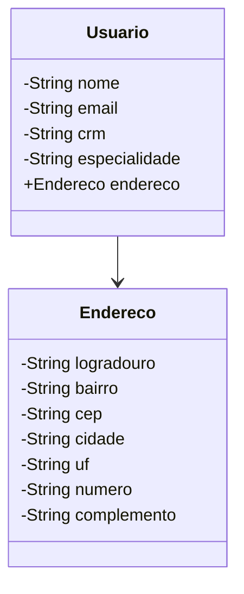

# medicos

```mermaid
classDiagram
    class Usuario {
        -String nome
        -String email
        -String crm
        -String especialidade
        +Endereco endereco
    }

    class Endereco {
        -String logradouro
        -String bairro
        -String cep
        -String cidade
        -String uf
        -String numero
        -String complemento
    }

    Usuario --> Endereco

```
